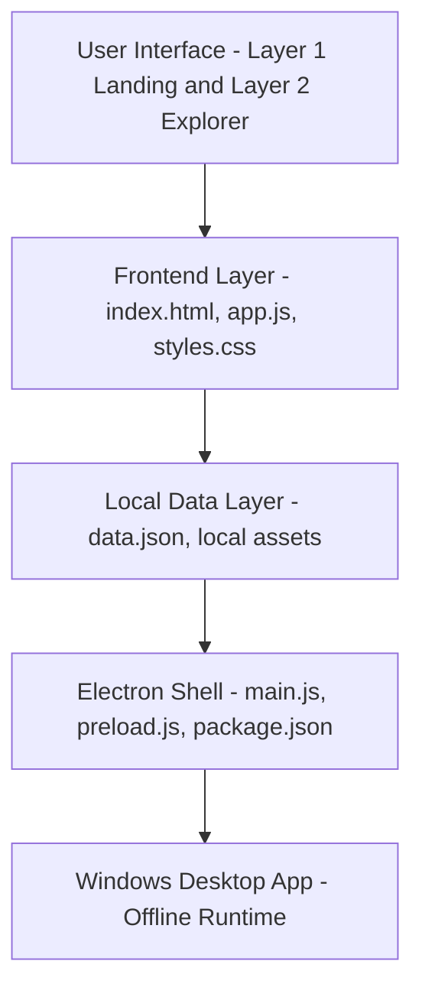

# 🏛️ Offline Exhibition App

> An interactive, offline-first science exhibition experience built as a responsive two-layer web application and packaged as a Windows desktop application using Electron.

---

## 📌 Overview

The application provides a digital exhibition experience through two distinct layers, ensuring a seamless journey from high-level exploration to deep-dive content consumption — without requiring an active internet connection.

- **Layer 1 (Landing Experience):** Exhibition overview, statistics, floor/theme layouts, and introductory content.
- **Layer 2 (Exploration Experience):** Theme-based exhibit browsing, search functionality, interactive cards, and detailed metadata.

---

## ✨ Key Features

- **Two-Layer Navigation** — Smooth transition between the macro exhibition overview and micro exhibit exploration.
- **Offline-First Architecture** — The core runtime requires zero CDN resources, remote APIs, or localhost servers. All HTML, CSS, JS, and JSON data are bundled locally.
- **Native Desktop Packaging** — Wrapped via Electron to deliver a standalone, native-feeling Windows application.
- **Data-Driven Content** — Fully dynamic rendering based on a structured local JSON data model.
- **Search & Filtering** — Quickly locate specific exhibits across multiple floors and scientific themes.

---

## 🏗️ Architecture

The architecture maintains a strict separation between content, frontend logic, and desktop packaging, allowing each component to evolve independently.



---

## 📂 Project Structure

```text
Offline-Exhibition-App/
├── assets/                  # Local images and icons
├── desktop/
│   └── Electron wrapper/
│       ├── main.js          # Electron main process
│       ├── preload.js       # Context bridge for security
│       ├── package.json     # Electron dependencies
│       └── web/             # Bundled web resources
│           ├── index.html
│           ├── app.js
│           ├── styles.css
│           └── data.json
├── index.html               # Standard web entry point
├── app.js                   # Core frontend logic
├── styles.css               # Application styling
├── data.json                # Structured exhibition content
└── README.md
```

---

## 🚀 Getting Started

### Prerequisites

- [Node.js](https://nodejs.org/) installed on your machine.
- Git for cloning the repository.

### Running the Web Version (Development)

The frontend uses local files and local exhibition data. Serve the root directory using any local development server (e.g., VS Code Live Server, or Node `http-server`).

```bash
# Example using http-server
npm install -g http-server
http-server .
```

### Running the Electron Version (Local App)

Navigate to the Electron wrapper directory and start the application:

```bash
cd "desktop/Electron wrapper"
npm install
npm start
```

### Building the Windows Executable

To generate a standalone `.exe` package that bundles the Electron runtime, application code, local data, and assets for offline distribution:

```bash
cd "desktop/Electron wrapper"
npm run build:portable
```

The generated executable will be available in the `dist/` or `build/` output folder (as configured in `package.json`).

---

## 📊 Data Model & Themes

Exhibition content is kept entirely separate from presentation logic via structured JSON records, making it trivial to update, extend, and reuse without altering code.

**Exhibition Themes Covered:**

- 🌌 Space & Universe
- ⚙️ Physics & Technology
- 🧬 Human Body & Life
- 🌍 Earth, Climate & Environment
- 🌱 Agriculture, Food & Future

---

## 🔒 Security & Future Scope

While currently optimized for demonstration and offline reliability, future production iterations will target:

- **Security** — Strict Content Security Policies (CSP), secure Electron configurations, and signed Windows builds.
- **Content Management** — A dedicated CMS pipeline to update JSON records dynamically.
- **Performance** — Advanced local asset caching, image compression, and optimized startup times for larger datasets.

---

## 🛠️ Tech Stack

| Layer            | Technology                     |
|-------------------|--------------------------------|
| Frontend          | HTML5, CSS3, Vanilla JavaScript |
| Data              | Local JSON                     |
| Desktop Packaging | Electron                       |
| Build Target      | Windows (.exe, portable)       |

---

## 📄 License

This project is provided for demonstration and portfolio purposes.

---

## 🙌 Acknowledgements

Built as part of an offline-first exhibition experience initiative — designed for reliability in environments without internet connectivity.
